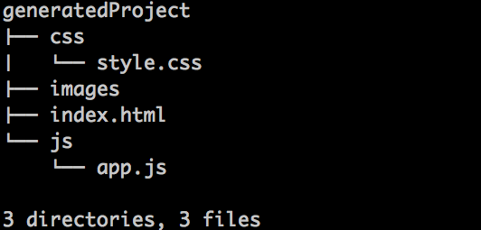
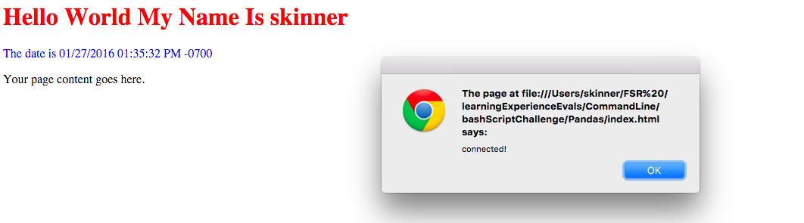

}#BashScript Challenge

##The Story

You have a friend who has started to learn how to write bash scripts. You being an excellent galvanizer and awesome friend have offered to help find/fix any errors that arise in your friends application.

Your friend would like to create a script that generates the basic file structure and templates for a simple web page, with the `index.html` page completely linked up.

Below is a sample of the ideal tree structure.

##The Challenge

Your friend is new to bash scripting. Clone this repo and review their script in `generator.sh`. Work to make sure their script generates the appropriate file structure. Fix any errors you find, and add any additional commands that may be necessary. *Note* Be sure that all files are accessible to the owner, and that the final product is completely wired up. When you open the `index.html` file you should be able to see your CSS styles, and you should receive an alert from your javascript.

(*Hint* you can run your script using `sh <scriptName>`)

##The Stretch
- User can dynamically set the name of the project folder
- HTML page dynamically renders the name of the user who created the file
- HTML page dynamically renders the date of creation

###Resources
[Basic bash-script tutorial](http://ryanstutorials.net/bash-scripting-tutorial/bash-script.php)
[Writing Shell Script Guide](http://linuxcommand.org/lc3_writing_shell_scripts.php#contents)

Let's see how good you really are with the CLI!
